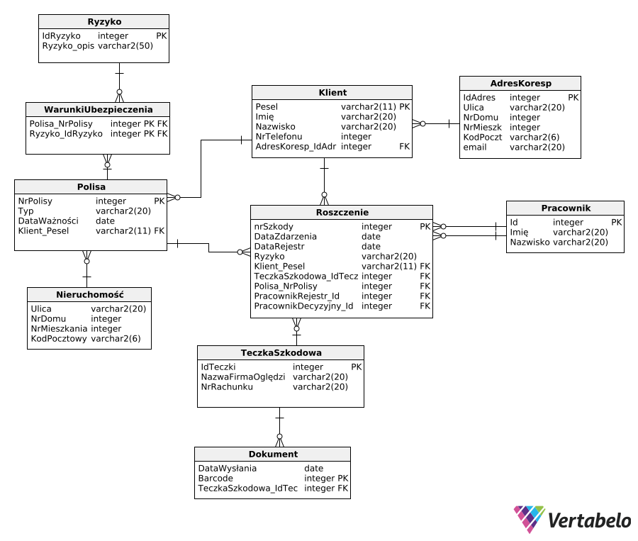

# Database for Insurance Company (TU)

> **Note**: This project is in Polish. The database is designed and implemented in the Polish language.

## Project Objective
The goal of this project is to create a database for an Insurance Company (TU). The main aim is to provide an organized, secure, and easy-to-manage system for storing and processing data related to customers, policies, claims, and documentation. The database will enable efficient management of information, leading to faster customer service and increased data consistency and security.

## Functional Scope of the Database
The database has been designed to fulfill the following functionalities:

### 1. Customer Management:
- Storing customer data such as first name, last name, PESEL, phone number, and correspondence address.

### 2. Insurance Policy Management:
- Storing detailed information about insurance policies, including the type of policy and the risks covered.

### 3. Claims Registration:
- Collecting information about reported claims, including the claim date, customer details, inspection company, documents, and responsible persons.

### 4. Documentation Management:
- Managing documents related to claims that are sent and received from customers.

### 5. Managing Inspection Companies and Personnel:
- Linking claims to specific inspection companies and employees responsible for registration and decision-making.

## Database Users
The database is designed for internal use by employees of the Insurance Company. The main user groups are:

- **Customer Service Department:** Access to customer data, policies, and claims history.
- **Claims Settlement Department:** Management of claims, documentation, and communication with inspection companies.
- **Management:** Access to reports and statistics related to the company's operations.

## Database Structure
The database consists of the following tables:

### 1. Klient
- Stores customer data such as first name, last name, PESEL, phone number, and correspondence address.

### 2. Polisa
- Stores information about insurance policies, such as the unique policy number, type, validity date, and associated client.

### 3. Ryzyko
- Contains a list of insurance risks, such as fire, flood, theft.

### 4. Warunki Ubezpieczenia
- A table linking risks with specific policies.

### 5. Roszczenie
- Stores information about reported claims, such as the event date, registration date, assigned risk, client data, documents, and decision-making workers.

### 6. Dokument
- Contains data about documents related to claims, including the sent date and barcode.

### 7. Teczka Szkodowa
- Stores information about inspection companies and bank account numbers associated with claims.

### 8. Pracownik
- Stores data about employees responsible for registering claims and making decisions on claims.

### 9. Nieruchomość
- Stores information about properties covered by insurance policies.

## Relationships Between Tables
- Each client has one or more policies, and each policy is assigned to one client.
- Each policy contains a set of covered risks, which are linked via the "Insurance Conditions" table.
- Each claim is associated with one policy, one client, and one claims folder.
- The Document table is linked to the Claims Folder table, enabling storage of documentation related to claims.
- Employees register claims and make decisions regarding claims.

## Data Security and Consistency
The database uses primary and foreign keys to ensure data consistency:

- **Primary Keys**: For example, PESEL in the "Klient" table and the unique policy number in the "Polisa" table ensure unique identification of records.
- **Foreign Keys**: For instance, the policy number in the "Warunki Ubezpieczenia" table refers to the "Polisa" table.
- **Data Types and Constraints**: Constraints such as text field lengths and unique keys minimize data entry errors.

## Example Reports and Analytics
Based on the data in the database, the following reports can be generated:

1. List of active policies with their expiration dates.
2. Summary of reported claims categorized by risk type.
3. Statistics on the number of claims reported in a given period.
4. Performance analysis of employees in the claims handling process.
5. Report on documents associated with a selected claim.

## Summary
The database project for the Insurance Company is designed to manage data related to customers, policies, claims, and documents. With the table structure and relationships, the system allows for storing and quickly retrieving information, such as policy details, claim numbers, and documents related to claims folders. The designed database allows for adding new data and analyzing existing information, ensuring better management of information, which is expected to improve customer service quality and insurance processes in the company.

